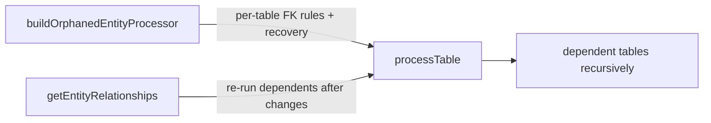

# PreflightCheck Alignment — Enhancement Plan

Date: 2026-08-26  
Tool: `tools/settingsHealthCheck` (OJS 3.3 / PHP 7.4)  
Status: **draft — pending approval before implementation**

**Goal:** Align the settings health check tool with PKP's OJS 3.4 preflight orphan-cleanup model where it adds value, without replacing the tool's existing strengths (bulk deleted-journal cleanup, metrics, staged confirmation).

**References:**

- [pkp-lib `PreflightCheckMigration`](https://github.com/pkp/pkp-lib/blob/stable-3_4_0/classes/migration/upgrade/v3_4_0/PreflightCheckMigration.php) — base orphan processors, `processTable()` recursion, FK helper methods
- [OJS `PreflightCheckMigration`](https://github.com/pkp/ojs/blob/stable-3_4_0/classes/migration/upgrade/v3_4_0/PreflightCheckMigration.php) — context binding, OJS-specific processors, `getEntityRelationships()` graph
- [OJS context binding (~L54)](https://github.com/pkp/ojs/blob/stable-3_4_0/classes/migration/upgrade/v3_4_0/PreflightCheckMigration.php#L54) — `journals` / `journal_id` / `journal_settings`
- [OJS processors + relationship graph (~L253)](https://github.com/pkp/ojs/blob/stable-3_4_0/classes/migration/upgrade/v3_4_0/PreflightCheckMigration.php#L253) — `buildOrphanedEntityProcessor()` through `getEntityRelationships()`
- Existing spec: `docs/superpowers/specs/2026-08-26-deleted-journal-records-design.md`
- Implemented Pass F plan: `docs/superpowers/plans/2026-08-26-deleted-journal-leftovers.md`

---

## Background

PKP runs a preflight migration during the 3.3 → 3.4 upgrade that cleans orphaned database rows before foreign keys are enforced. The implementation is split across two repositories:

| Layer | Responsibility |
|---|---|
| **pkp-lib** | Generic orphan cleanup: `deleteRequiredReference`, `cleanOptionalReference`, `deleteOptionalReference`, `processTable()` recursion |
| **OJS app** | Context abstraction (`journals`, `journal_id`, `journal_settings`), OJS-only table processors, `getEntityRelationships()` dependency graph, upgrade blockers (DOI agencies) |

Our tool already implements **Pass F (deleted-journal leftovers)** via `JournalCascadeRegistry` — a declarative cascade plan that bulk-finds and bulk-deletes rows belonging to dead journal IDs. That solves a problem PKP preflight only partially addresses (via per-column `deleteRequiredReference` on `context_id`/`journal_id`, table by table).

This plan defines **what to borrow** from PKP and **what to keep separate**.

---

## PKP's dual mechanism (do not conflate)



1. **Processors** — explicit rules per table/column, including non-FK cases (e.g. `publication_settings.issueId`).
2. **Relationship graph** — tells `processTable()` which dependents to re-process after a parent table changed.

Our `JournalCascadeRegistry` is closest to **`getEntityRelationships`**, not to **`buildOrphanedEntityProcessor`**. Enhancements should mirror the correct half:

- **Graph expansions** → extend Pass F / `JournalCascadeRegistry`
- **Per-column orphan rules + recovery** → new passes (G, H)
- **Setting-value orphans** → new pass (G)
- **Upgrade blockers** → report-only warnings (Tier 5)

---

## Current state vs PKP (OJS layer included)

| Concern | PKP OJS preflight | Tool today |
|---|---|---|
| Dead journal direct roots | `deleteRequiredReference` per FK column | Pass F bulk scan + cascade — **stronger at scale** |
| Descendant cleanup | Recursive `processTable()` from relationship graph | Static `DEFAULT_DESCENDANTS` — **gaps listed below** |
| Cross-parent orphans (bad `section_id`, missing `user_id`, etc.) | Per-column processors | Pass C covers `*_settings` FK orphans only |
| Setting-value orphans (`issueId` in `publication_settings`) | Dedicated processor, not FK-based | **Not covered** |
| Recovery before delete (`publications.section_id`) | Yes, with installer logging | **Not covered** |
| Optional FK semantics (`cleanOptionalReference`) | NULL or delete depending on column | Pass F always DELETE |
| `metrics` | Not in PKP graph | Covered — **tool is ahead** |
| Physical file cleanup (REVIEW_REVISION) | DB only | Tool deletes files on `--fix` — **tool is ahead** |
| Upgrade blockers (DOI agencies, editor roles) | Throws in `up()` | Not in scope |
| Production safety | Auto-runs during upgrade | 3-stage TTY confirmation — **keep** |

---

## Cascade gaps — `getEntityRelationships` as checklist

Use [OJS `getEntityRelationships`](https://github.com/pkp/ojs/blob/stable-3_4_0/classes/migration/upgrade/v3_4_0/PreflightCheckMigration.php#L256) as the authoritative diff against `JournalCascadeRegistry`.

### Missing journal roots

Listed under `journals => [...]` in PKP but absent from our direct roots:

| Table | Column | Notes |
|---|---|---|
| `subeditor_submission_group` | `context_id` | Journal-scoped; PKP deletes when journal parent missing |

**Deliberately excluded (unchanged):** `notification_subscription_settings` — string `context`, not a journal FK (see design spec).

### Missing or incomplete descendant chains

| PKP parent | Children not traversed today |
|---|---|
| `submission_files` | `submission_file_revisions`, self-ref chain, `review_files` |
| `submission_search_objects` | `submission_search_object_keywords` |
| `data_object_tombstones` | `data_object_tombstone_settings` (only OAI assoc root exists today) |
| `files` | orphan `files` rows after `submission_files` removed |
| `filters` | `filter_settings`, nested `filters` |
| `categories` | nested `categories`, `publication_categories` |
| `navigation_menus` | `navigation_menu_item_assignments` |
| `library_files` | `library_file_settings` |
| `review_assignments` | `review_form_responses` (only chained via `review_form_elements` today) |
| `queries` | `query_participants` |

### Non-FK edges PKP handles explicitly

These will **not** appear in a pure FK cascade and need dedicated detection:

| Case | PKP location | Mechanism |
|---|---|---|
| `publication_settings.issueId` → missing `issues.issue_id` | OJS processor ~L236–252 | `CAST(issue_id AS CHAR)` join on `setting_value`; delete setting row |
| `issues → publication_settings` in relationship graph | `getEntityRelationships` | Driven by `issueId` setting, not a column FK |

### Already well covered (Pass F)

OJS processors for: `issues`, `sections`, `subscription_types`, `subscriptions`, `completed_payments`, `custom_issue_orders`, `custom_section_orders`, `institutional_subscriptions`, and `*_settings` descendants under issues / sections / galleys.

---

## Enhancement tiers (prioritized)

Implement in order. Each tier is independently shippable.

### Tier 1 — Extend Pass F using `getEntityRelationships`

**Risk:** Low. Same mental model as today.  
**Primary file:** `src/JournalCascadeRegistry.php`

- [ ] Add `subeditor_submission_group` as a direct root (`context_id`, identity TBD from schema).
- [ ] Extend `submission_files` descendants: add `submission_file_revisions` (delete before `submission_files`).
- [ ] Consider `files` cleanup after `submission_files` / `submission_file_revisions` (may need separate orphan pass if files are shared).
- [ ] Add `submission_search_object_keywords` under `submission_search_objects`.
- [ ] Add `library_file_settings` under `library_files`.
- [ ] Add `filter_settings` and nested `filters` under `filters`.
- [ ] Add `data_object_tombstone_settings` under tombstone chain (may require new root or assoc entry).
- [ ] Add `navigation_menu_item_assignments` under `navigation_menus`.
- [ ] Add `review_form_responses` under `review_assignments`.
- [ ] Add `publication_categories` and nested `categories` under `categories`.
- [ ] Add `query_participants` under `queries` (confirm journal reachability via submission context).
- [x] Harden `--fix`: always execute journal-root deletes for every plan step that has rows, not only tables present in scan findings (`Fixer.php` — journal roots always run as of 2026-08-26).
- [ ] Align delete chunk size from 500 → **1000** (PKP standard) if performance allows.

**Verification:** Re-run `php tools/settingsHealthCheck/settingsHealthCheck.php -a -d` on `ojs_3_3_0`; confirm live journal #22 untouched; compare table/row counts before and after registry expansion.

**Schema audit (Step 1, completed 2026-08-26):** see `docs/superpowers/plans/2026-08-26-tier1-schema-audit.md`.

---

### Tier 2 — Pass G: setting-value orphans

**Risk:** Low–medium. New pass, scan-only by default.  
**Mirrors:** OJS `buildOrphanedEntityProcessor` ~L236–252 (not FK-based).

- [ ] Add `Scanner::CHECK_SETTING_VALUE_ORPHAN` (Pass G).
- [ ] Detect `publication_settings` rows where `setting_name = 'issueId'` and `setting_value` does not match any live `issues.issue_id` (use `CAST(issue_id AS CHAR(20))` per PKP).
- [ ] Emit findings with a new reason code (e.g. `REASON_SETTING_VALUE_ORPHAN`).
- [ ] `--fix` deletes the offending setting row(s), not the parent publication.
- [ ] Document in README; add scenario to interactive report.

**Future candidates:** other serialized ID settings discovered in OJS/pkp-lib processors or schema metadata.

**Verification:** Manual seed of invalid `issueId` on a test publication; confirm detection and fix.

---

### Tier 3 — Pass H: general entity orphans (pkp-lib + OJS processors)

**Risk:** Medium–high. Broader scope; different problem from deleted journals.  
**Mirrors:** pkp-lib helpers + both `buildOrphanedEntityProcessor` implementations + `processTable()` recursion.

- [ ] New class `OrphanReferenceCleaner` (or equivalent) porting:
  - `deleteRequiredReference($table, $column, $parentTable, $parentColumn, $filter?)`
  - `cleanOptionalReference(...)` — SET NULL where nullable
  - `deleteOptionalReference(...)` — DELETE when nullable FK is semantically required
  - `validateColumns()` — skip missing tables/columns with warnings
- [ ] Register processors from **both** pkp-lib base and OJS extension (merged table list).
- [ ] Drive execution with PKP-style `processTable()` recursion using OJS `getEntityRelationships()` graph (adapted to OJS 3.3 schema).
- [ ] New CLI flag (e.g. `--entity-orphans`) — off by default; include in `-a` only after stable.
- [ ] **Do not** apply `cleanOptionalReference` semantics to Pass F deleted-journal fix.

**Catches:** orphans inside **live** journals (bad `user_id`, dangling `publication_id`, missing `files` row, etc.).

**Verification:** Compare orphan counts against a staging DB before/after; spot-check PKP processor tables (`submissions`, `submission_files`, `stage_assignments`, `publications`).

---

### Tier 4 — Recovery before delete

**Risk:** Medium. Mutates data to avoid deletion; needs explicit opt-in.  
**Mirrors:** OJS publications processor ~L75–96; pkp-lib `current_publication_id` recovery.

- [ ] Add `--recover` sub-step (runs before `--fix`, or as part of fix with extra confirmation).
- [ ] **`publications.section_id`:** reassign to `MIN(section_id)` of active sections (`is_inactive = 0`) in the same journal before orphan delete.
- [ ] **`submissions.current_publication_id`:** repoint to latest `publications.publication_id` for that submission when current pointer is invalid.
- [ ] Log every recovery action (PKP installer log equivalent → report / stdout).
- [ ] Report recovered count separately from deleted count.

**Verification:** Seed invalid `section_id` / `current_publication_id`; confirm recovery then reduced orphan count.

---

### Tier 5 — Upgrade-readiness checks (report-only)

**Risk:** Low. No mutation.  
**Mirrors:** OJS `up()` ~L29–40; pkp-lib pre-upgrade throws.

- [ ] **`checkDuplicateDoiRegistrationAgencies`:** detect submissions/galleys/issues with multiple DOI agency status settings; report with pointer to `php tools/resolveAgencyDuplicates.php`.
- [ ] Optionally surface pkp-lib blockers as warnings only: locale conflicts, authors missing user group, submission checklist, contact setting, etc.
- [ ] New reason code or warning section — not mixed into orphan fix passes.

---

### Tier 6 — Context abstraction (optional, low urgency)

**Risk:** Low. Refactor only.  
**Mirrors:** OJS ~L42–55 context getters.

- [ ] Introduce `ContextConfig` (or equivalent): `table = journals`, `key = journal_id`, `settings = journal_settings`.
- [ ] `JournalCascadeRegistry` consumes `ContextConfig` instead of hardcoding names.
- [ ] Enables future OMP/OPS variants without rewriting the cascade.

---

## What not to copy from PKP

| PKP behavior | Reason to keep separate |
|---|---|
| `processTable()` recursion **for Pass F** | Static plan + per-journal transactions is faster and auditable for millions of rows |
| `cleanOptionalReference` in deleted-journal fix | Orphaned rows for dead journals should be deleted, not nulled |
| `notification_subscription_settings` | String `context` — excluded by design |
| Auto-run during upgrade | 3-stage TTY gate is correct for production |
| pkp-lib processor list alone | Must merge with OJS extension — base misses issues, subscriptions, issue galleys, etc. |
| `dropForeignKeys()` | Upgrade-only; irrelevant on OJS 3.3 maintenance |

---

## Proposed architecture after all tiers

```
Scanner passes:
  A   Schema missing locale
  B   Heuristic locale mismatch
  C   Orphaned settings (FK LEFT JOIN)
  D   NULL setting_value
  E   REVIEW_REVISION filesystem orphans
  F   Deleted-journal leftovers (JournalCascadeRegistry)     ← Tier 1 expands this
  G   Setting-value orphans (issueId, etc.)                  ← Tier 2
  H   General entity orphans (OrphanReferenceCleaner)          ← Tier 3

Fixer:
  --recover   Tier 4 recovery (optional, before fix)
  --fix       Existing staged confirmation; Pass F hardened in Tier 1

Report:
  Tier 5 warnings section for upgrade blockers
```

---

## Suggested implementation order

| Phase | Tiers | Rationale |
|---|---|---|
| **Phase A** | Tier 1 | Smallest diff, closes cascade gaps against PKP graph, hardens fixer |
| **Phase B** | Tier 2 | High-value OJS-specific gap (`issueId`); no FK cascade can catch it |
| **Phase C** | Tier 4 | Recovery reduces data loss before expanding fix scope |
| **Phase D** | Tier 3 | Largest scope; general orphan pass for live-journal integrity |
| **Phase E** | Tier 5 + 6 | Reporting polish and optional refactor |

**Recommended first PR:** Phase A (Tier 1) + Tier 2 `issueId` check.

---

## Constraints (same as existing tool plans)

1. **No commits** unless the user explicitly requests them.
2. **No new test suite** unless requested — verify with `php -l` and staged manual runs on `ojs_3_3_0`.
3. **Follow existing conventions:** OJS file-doc headers, `final class`, typed properties, `\Throwable` degraded to warnings where appropriate, `tableExists()` / `columnExists()` guards.
4. **OJS 3.3 compatibility:** PHP 7.4, Illuminate Capsule without facade root, `require_once` wiring.
5. **Live journal safety:** never delete rows belonging to journals that still exist in `journals`.
6. **Preserve 3-stage confirmation** for any new `--fix` paths.

---

## Open questions (resolve before Phase D)

1. **`files` table:** shared across contexts? Delete only when unreferenced after submission_file cleanup, or always cascade from journal scope?
2. **`queries` / `query_participants`:** confirm journal linkage path on OJS 3.3 schema before adding to Pass F.
3. **`data_object_tombstones` vs `submission_tombstones`:** which tombstone tables exist on 3.3 and how they relate to journal deletion?
4. **Pass H in `-a`:** include by default once stable, or keep opt-in permanently to avoid long scan times?
5. **`static_pages`:** present in PKP relationship graph — journal-scoped on 3.3?

---

## Success criteria

- [ ] `JournalCascadeRegistry` covers all journal-reachable tables in OJS `getEntityRelationships` except deliberate exclusions.
- [ ] Invalid `publication_settings.issueId` rows detected and fixable.
- [ ] `--fix` for deleted journals cannot skip tables due to findings-only gating.
- [ ] Live journal (#22 on test DB) row counts unchanged after fix dry-run and staged fix.
- [ ] README documents new flags, passes, and PKP alignment rationale.
